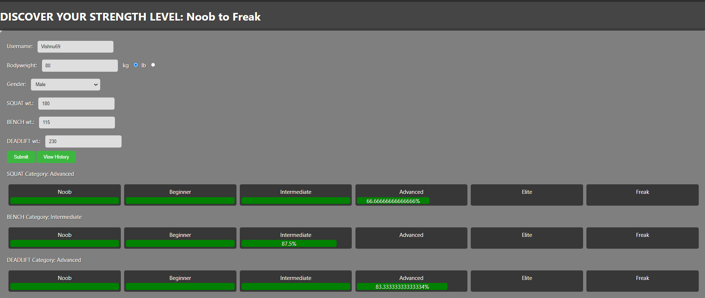
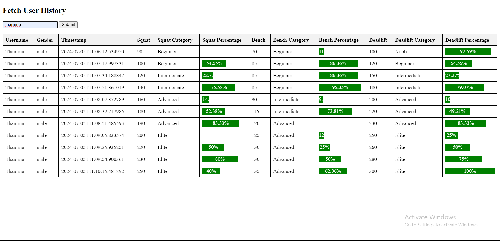
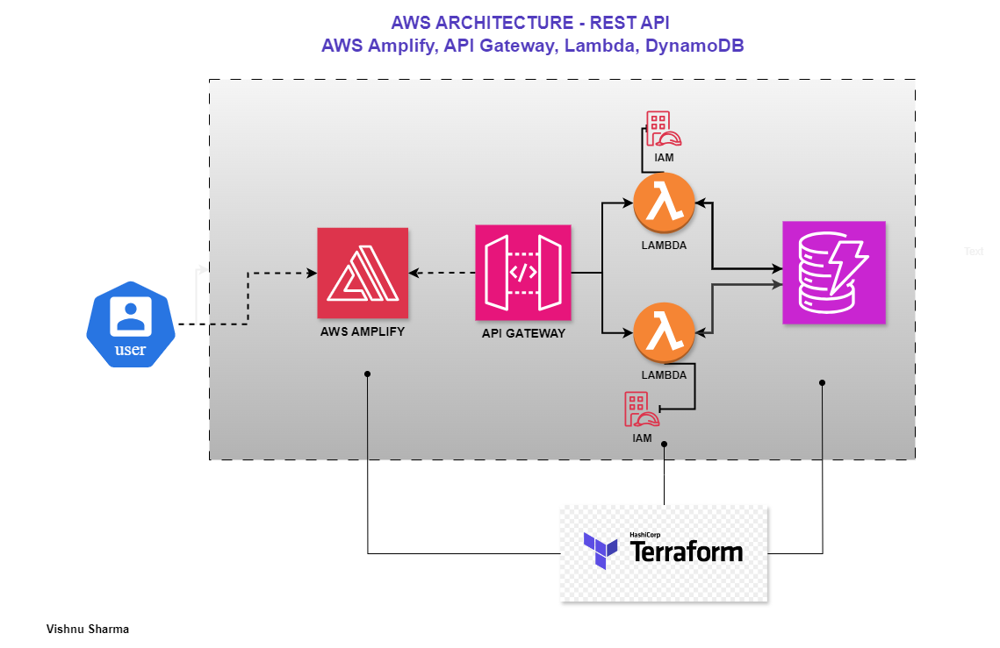

# Strength Level Categorization Web Application - API Gateway, Lambda, DynamoDB 

This web application categorizes your strength level from NOOB to FREAK based on your squat, bench press, and deadlift strengths, tailored according to your gender. It also provides an option to retrieve the history of all your previous results and data.





## Architecture

The application is hosted on AWS with the following components:
- **Frontend**: Basic HTML files stored in a GitHub repository and hosted using AWS Amplify.
- **Backend**: AWS Lambda functions for data processing and storage, integrated with API Gateway.
- **Database**: DynamoDB for storing strength data and historical results.
- **Infrastructure as Code**: Managed using Terraform.

  


## Project Structure

- `index.html`: Main file for submitting strength data and getting results.
- `History.html`: File for displaying the history of previous results.
- `strength_cat.drawio.png`: Diagram illustrating the architecture of the application.
- `Strength_cat_terraform/`: Directory containing Terraform code files and modules for provisioning AWS resources.

### Prerequisites

- AWS Account
- Terraform installed
- GitHub repository with HTML files

## Setup Instructions

1. **Clone the Repository**:
    ```sh
    git clone https://github.com/VishnuSharma11D00/Strength_categorization.git
    cd strength-level-categorization
    ```

2. **Configure AWS CLI**:
    Ensure you have the AWS CLI configured with the necessary permissions to deploy resources.

3. **Deploy Infrastructure with Terraform**:
   For some reason, CORS was not working when deploying API Gateway through Terraform. Therefore, I created the API Gateway manually via the AWS console. Until I figure out the issue, please follow these steps:
   - Update local.tf.
   - In main.tf, comment out (/* ... */) module amplify and api gateway, then apply Terraform configuration 
    ```sh
    cd Strength_cat_terraform
    terraform init
    terraform apply
    ```
    -  Create API in API Gateway:
        1. Create a new REST API.
        2.  Root POST Method:
            - reate root resource (/).
            - Add POST method.
            - Integrate with Stren_cat_lambda.
            - Enable CORS: Add headers (Access-Control-Allow-Origin: '*', Access-Control-Allow-Methods: POST).
        3. history GET Method:
           - Create history resource.
           - Add GET method.
           - Integrate with History_lambda.
           - Enable CORS: Add headers (Access-Control-Allow-Origin: '*', Access-Control-Allow-Methods: GET).
           - In the Method Request section, add a query string parameter named 'username' and mark it as 'required'.
           - In the Integration Request section, configure the mapping template to pass the username parameter to the Lambda function. Add the following mapping template for 'application/json':
             ```sh
             {
               "queryStringParameters": {
                 "username": "$input.params('username')"
               }
             }
             ```
        4. Deploy API:
           - Deploy API to a stage (e.g., dev).
      - Now, uncomment amplify module. Copy the Stage url of root/POST and history/GET, and past it in the variables in local.tf; api_gateway_stage_url and api_gateway_stage_url_history. Apply Terraform commands
        
      ```sh
       terraform init
       terraform apply
      ```

4. **Connect AWS Amplify to GitHub**:
    - Navigate to the AWS Amplify Console.
    - Connect the Amplify app to your GitHub repository.
    - Deploy the frontend from the `main` branch by clicking on Deployments -> ```Run job```

5. **Access the Application**:
    - The application should now be accessible via the AWS Amplify domain.
    - Use the provided HTML files to interact with the backend API and view your strength results and history.
      
6. **Terminate**
  - Apply destroy command in Terraform:
    ```sh
    terraform destroy
    ```
  - Delete api from API Gateway from AWS console.


## Concept Inspiration:
Jeff Nippard
link: [https://youtu.be/LrDJXIQ_-eg?si=77Wd8-8Ozq0IwjXW]
      
